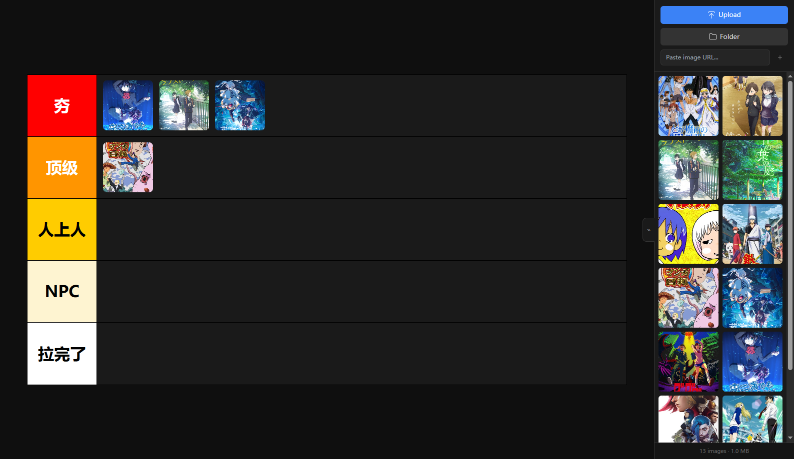

# 「从夯到拉」排行榜

一个拖拽式图片排名应用，支持本地图片上传和 URL 添加。

## 功能特性

- **核心组件** - 基于 [h2l-ranking](https://github.com/imba97/h2l-ranking) 组件
- **拖拽排序** - 支持将图片拖拽到不同等级进行分类
- **多级排名** - 五个等级：夯、顶级、人上人、NPC、拉完了
- **图片管理** - 支持上传本地图片或通过 URL 添加
- **数据持久化** - 使用 IndexedDB 和 localStorage 保存数据
- **响应式设计** - 适配不同屏幕尺寸
