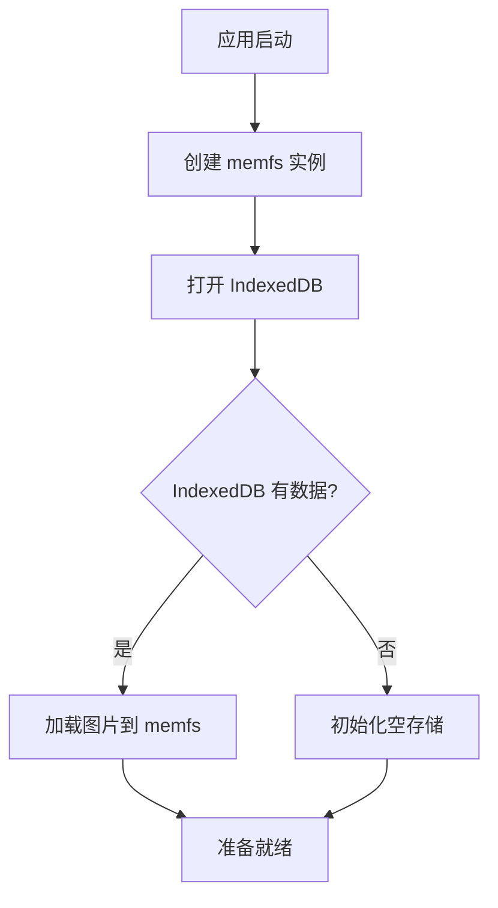
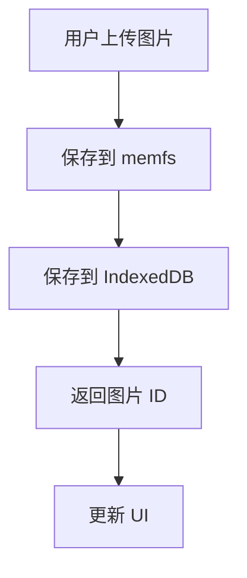

# Image Storage System

## 需求

用户上传的图片需要持久化存储，刷新页面后依然保留。

## 技术方案

### 方案对比

| 方案 | 优点 | 缺点 | 推荐度 |
|------|------|------|--------|
| memfs + IndexedDB | 内存+持久化，性能好 | 需要额外封装 | ⭐⭐⭐⭐⭐ |
| IndexedDB 直接 | 原生支持 | API 复杂，需要封装 | ⭐⭐⭐ |
| Base64 + localStorage | 简单 | 容量限制（5MB），性能差 | ⭐ |
| File System Access API | 原生文件访问 | 兼容性差，需要用户授权 | ⭐⭐ |

### 推荐方案: memfs + IndexedDB

使用 `memfs` 作为内存文件系统接口，配合 IndexedDB 实现持久化。

## 实现细节

### 1. 安装依赖

```bash
pnpm add @zenfs/core @zenfs/dom
```

使用 `@zenfs/core`（原 memfs 的继任者）作为内存文件系统。

### 2. 存储架构

```typescript
// 存储 Service
class ImageStorageService {
  private fs: IFS
  private dbName = 'h2l-ranking-images'
  private storeName = 'images'

  // 初始化：从 IndexedDB 加载到内存
  async init(): Promise<void>

  // 保存图片
  async saveImage(file: File): Promise<string>

  // 获取图片
  async getImage(id: string): Promise<Blob | null>

  // 删除图片
  async deleteImage(id: string): Promise<void>

  // 持久化到 IndexedDB
  async persist(): Promise<void>

  // 获取所有图片列表
  async listImages(): Promise<ImageResource[]>
}
```

### 3. 数据结构

```typescript
interface StoredImage {
  id: string // 唯一标识 (UUID)
  name: string // 原始文件名
  mimeType: string // MIME 类型
  data: ArrayBuffer // 图片二进制数据
  createdAt: number // 创建时间戳
  size: number // 文件大小（字节）
}
```

### 4. 容量限制

- **单张图片**: 限制 10MB
- **总存储空间**: 限制 100MB
- **超时处理**: 超出容量时提示用户删除旧图片

### 5. 路径规划

```
/images/
  /{uuid}.jpg
  /{uuid}.png
  /thumbnails/
    /{uuid}_thumb.jpg  // 可选：生成缩略图
```

## API 设计

```typescript
// composables/useImageStorage.ts
export function useImageStorage() {
  const storage = new ImageStorageService()

  // 上传图片
  const uploadImage = async (file: File): Promise<ImageResource> => {
    // 1. 验证文件类型和大小
    // 2. 生成 UUID
    // 3. 保存到 memfs
    // 4. 持久化到 IndexedDB
    // 5. 返回资源对象
  }

  // 获取图片 URL
  const getImageUrl = (id: string): string => {
    // 从 memfs 读取并创建 blob URL
  }

  // 删除图片
  const deleteImage = async (id: string): Promise<void> => {
    // 从 memfs 删除
    // 从 IndexedDB 删除
  }

  // 列出所有图片
  const listImages = async (): Promise<ImageResource[]> => {
    // 从 IndexedDB 读取元数据
  }

  return {
    uploadImage,
    getImageUrl,
    deleteImage,
    listImages
  }
}
```

## 初始化流程



## 持久化流程



## 清理策略

1. **未引用图片清理** - 定期检查并删除不在排行榜中的图片
2. **过期清理** - 提供清理超过 N 天未使用的图片功能
3. **手动清理** - 用户可在资源管理器中手动删除
