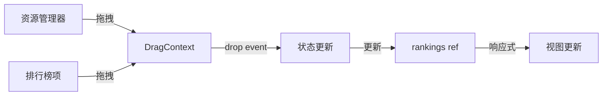

# Drag & Drop

## 依赖安装

```bash
pnpm add vue3-dnd react-dnd-html5-backend
# 触摸设备支持（可选）
pnpm add react-dnd-touch-backend
```

## 概述

使用 [vue3-dnd](https://www.vue3-dnd.com/) 实现拖拽功能。该库基于 React DnD 开发，支持 Composition API，可以使用 React DnD 的 backend（如 `react-dnd-html5-backend`）。

实现从资源管理器拖拽图片到排行榜各档位的功能。

## 拖拽场景

### 1. 资源管理器 → 排行榜

从右侧资源面板拖拽图片到任意档位行。

### 2. 排行榜内部排序

在同一档位内调整图片顺序。

### 3. 跨档位移动

将图片从一个档位拖到另一个档位。

### 4. 外部文件 → 排行榜

直接从操作系统拖拽图片文件到排行榜。

## 技术选型

使用 [vue3-dnd](https://www.vue3-dnd.com/) + `react-dnd-html5-backend`

### 安装

```bash
pnpm add vue3-dnd react-dnd-html5-backend
# 触摸设备支持
pnpm add react-dnd-touch-backend
```

### 优点

- 基于 React DnD，功能成熟
- 原生支持 Vue 3 Composition API
- 可以使用 React DnD 的所有 backend
- TypeScript 友好

## 实现方案

### 方案 A: 修改 h2l-ranking 源码（推荐）

1. Fork h2l-ranking
2. 集成 vue3-dnd
3. 添加拖拽相关 props 和 events

```vue
<!-- H2lRanking.vue 增强 -->
<template>
  <DndProvider :backend="HTML5Backend">
    <!-- 原有内容，每个 item 使用 useDrag，每行使用 useDrop -->
  </DndProvider>
</template>

<script setup lang="ts">
import { HTML5Backend } from 'react-dnd-html5-backend'
import { DndProvider, useDrag, useDrop } from 'vue3-dnd'

interface Props {
  rankings: Rankings
  enableImageViewer?: boolean
  draggable?: boolean // 新增：是否启用拖拽
  droppable?: boolean // 新增：是否允许外部拖入
}

interface Emits {
  (e: 'dropRow', row: keyof Rankings, data: any): void
  (e: 'reorder', row: keyof Rankings, fromIndex: number, toIndex: number): void
}

const emit = defineEmits<Emits>()

// 拖拽源 hook
function useDragItem(item: RankingItem, row: keyof Rankings, index: number) {
  return useDrag(() => ({
    type: 'RANKING_ITEM',
    item: { item, row, index },
    collect: monitor => ({
      isDragging: monitor.isDragging()
    })
  }))
}

// 放置目标 hook
function useDropRow(row: keyof Rankings) {
  return useDrop(() => ({
    accept: ['RANKING_ITEM', 'RESOURCE_IMAGE'],
    drop: item => emit('dropRow', row, item),
    collect: monitor => ({
      isOver: monitor.isOver(),
      canDrop: monitor.canDrop()
    })
  }))
}
</script>
```

### 方案 B: 包装组件

创建包装组件，在外层实现拖拽逻辑。

```vue
<!-- DraggableRanking.vue -->
<template>
  <div class="draggable-ranking" @drop="handleDrop" @dragover.prevent>
    <H2lRanking :rankings="rankings" />
    <!-- 拖拽覆盖层 -->
  </div>
</template>
```

限制：无法实现内部排序，只能实现外部拖入。

### 方案 C: 独立开发

不使用 h2l-ranking，基于其源码独立开发并集成拖拽。

## 数据流



## 拖拽数据格式

```typescript
// 从资源管理器拖出
interface DragDataFromResource {
  type: 'resource'
  id: string
  src: string
  name: string
}

// 排行榜内部拖拽
interface DragDataFromRanking {
  type: 'ranking-item'
  row: keyof Rankings
  index: number
  item: RankingItem
}

// 外部文件拖拽
interface DragDataFromFile {
  type: 'file'
  file: File
}
```

## API 设计

```typescript
import { HTML5Backend } from 'react-dnd-html5-backend'
// composables/useRankingDrag.ts
import { useDrag, useDrop } from 'vue3-dnd'

// 拖拽类型定义
export const DragItemTypes = {
  RANKING_ITEM: 'RANKING_ITEM',
  RESOURCE_IMAGE: 'RESOURCE_IMAGE',
  EXTERNAL_FILE: 'EXTERNAL_FILE'
} as const

export function useRankingDrag(rankings: Ref<Rankings>) {
  // 处理资源拖入
  const handleResourceDrop = (row: keyof Rankings, data: DragDataFromResource) => {
    rankings.value[row].push({
      title: data.name,
      cover: data.src
    })
  }

  // 处理排序
  const handleReorder = (
    row: keyof Rankings,
    fromIndex: number,
    toIndex: number
  ) => {
    const items = [...rankings.value[row]]
    const [removed] = items.splice(fromIndex, 1)
    items.splice(toIndex, 0, removed)
    rankings.value[row] = items
  }

  // 处理跨档位移动
  const handleCrossRowMove = (
    fromRow: keyof Rankings,
    fromIndex: number,
    toRow: keyof Rankings,
    toIndex?: number
  ) => {
    const item = rankings.value[fromRow][fromIndex]
    rankings.value[fromRow].splice(fromIndex, 1)
    if (toIndex !== undefined) {
      rankings.value[toRow].splice(toIndex, 0, item)
    }
    else {
      rankings.value[toRow].push(item)
    }
  }

  // 排行榜项拖拽源
  const useRankingItemDrag = (item: RankingItem, row: keyof Rankings, index: number) => {
    return useDrag(() => ({
      type: DragItemTypes.RANKING_ITEM,
      item: { item, row, index },
      collect: monitor => ({
        isDragging: monitor.isDragging()
      })
    }))
  }

  // 排行榜行放置目标
  const useRankingRowDrop = (row: keyof Rankings) => {
    return useDrop(() => ({
      accept: [DragItemTypes.RANKING_ITEM, DragItemTypes.RESOURCE_IMAGE],
      drop: (item: any, monitor) => {
        const itemType = monitor.getItemType()
        if (itemType === DragItemTypes.RESOURCE_IMAGE) {
          handleResourceDrop(row, item)
        }
        else if (itemType === DragItemTypes.RANKING_ITEM) {
          handleCrossRowMove(item.row, item.index, row)
        }
      },
      collect: monitor => ({
        isOver: monitor.isOver(),
        canDrop: monitor.canDrop()
      })
    }))
  }

  return {
    handleResourceDrop,
    handleReorder,
    handleCrossRowMove,
    useRankingItemDrag,
    useRankingRowDrop
  }
}
```

## 视觉反馈

### 拖拽中

- 被拖拽元素半透明
- 显示拖拽预览（ghost image）

### 悬停档位

- 目标档位行高亮显示
- 显示插入位置指示器

### 放置无效

- 禁止图标
- 红色边框提示

```css
/* 示例样式 */
.h2l-ranking__row--drag-over {
  background: rgba(255, 255, 255, 0.1);
  box-shadow: inset 0 0 0 2px #0ff;
}

.h2l-ranking__item--dragging {
  opacity: 0.5;
}
```

## 触摸支持

移动端需要支持长按拖拽：

```typescript
import { usePointerSwipe } from '@vueuse/core'

const { isSwiping } = usePointerSwipe(target, {
  threshold: 10,
  onSwipe() {
    // 开始拖拽
  }
})
```

## 实现步骤

1. ✅ 安装 vue3-dnd 和 react-dnd-html5-backend
2. ✅ 修改/包装 h2l-ranking 组件
3. ✅ 实现资源管理器拖拽源
4. ✅ 实现排行榜拖拽目标
5. ✅ 处理拖拽数据和状态更新
6. ✅ 添加视觉反馈
7. ✅ 测试触摸设备支持（使用 react-dnd-touch-backend）
